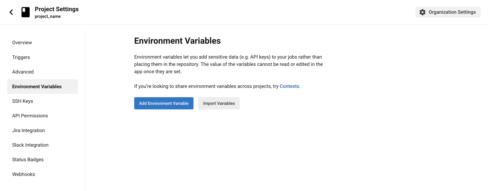

# KhoaDD6 Udacity Capstone Project

## Steps

1. [Setup Circle CI](#Setup-Environment)
2. [Setup EC2 Environment](#Setup-Circle-CI)
3. [Docker](#Docker)
4. [Kubernetes](#Kubernetes)

## Setup Environment

1. Create an EC2 (Ubuntu 22.02)
2. SSH to this EC2
3. Update packages

```sh
$ sudo apt update -y
```

4. Install **hadolint**

```sh
$ wget -O /bin/hadolint https://github.com/hadolint/hadolint/releases/download/v2.10.0/hadolint-Linux-x86_64
$ chmod +x /bin/hadolint
```

5. Install **kubectl**

```sh
$ curl -LO "https://dl.k8s.io/release/$(curl -L -s https://dl.k8s.io/release/stable.txt)/bin/linux/amd64/kubectl"
$ sudo install -o root -g root -m 0755 kubectl /usr/local/bin/kubectl
$ kubectl version --client
```

6. Install **eksctl**

```sh
$ curl --silent --location "https://github.com/weaveworks/eksctl/releases/latest/ download/eksctl_$(uname -s)_amd64.tar.gz" | tar xz -C /tmp
$ sudo mv /tmp/eksctl /usr/local/bin
$ eksctl version
```

7. Install **Docker**

```sh
$ sudo apt update
```

```sh
$ sudo apt install apt-transport-https ca-certificates curl software-properties-common
```

```sh
$ curl -fsSL https://download.docker.com/linux/ubuntu/gpg | sudo gpg --dearmor -o /usr/share/keyrings/docker-archive-keyring.gpg
```

```sh
$ echo "deb [arch=$(dpkg --print-architecture) signed-by=/usr/share/keyrings/docker-archive-keyring.gpg] https://download.docker.com/linux/ubuntu $(lsb_release -cs) stable" | sudo tee /etc/apt/sources.list.d/docker.list > /dev/null
```

```sh
$ sudo apt update
```

```sh
$ apt-cache policy docker-ce
```

```sh
$ sudo apt install docker-ce
```

```sh
$ sudo systemctl status docker
```

```sh
$ sudo usermod -aG docker ubuntu
```

```sh
$ docker version
```

## Docker

1. Build Docker Image

```sh
$ docker build --tag khoadd6-devops-capstone-project .
```

2. Push Docker Image

```sh
$ docker login -u dinhdangkhoa0201
$ docker tag khoadd6-devops-capstone-project dinhdangkhoa0201/khoadd6-devops-capstone-project:latest0
$ docker push dinhdangkhoa0201/khoadd6-devops-capstone-project:latest
```

3. Run Docker Image

```sh
$ docker run -p 80:80 dinhdangkhoa0201/khoadd6-devops-capstone-project:latest
```

## Kubernetes

1. Create an EKS Cluster

```sh
$ eksctl create cluster --config-file=cluster.yml
```

2. Deploy Kubernetes sources

```sh
$ kubectl create deployment udacity-app --image=dinhdangkhoa0201/khoadd6-devops-capstone-project:latest --replicas=4
```

3. Expose PORT

```sh
$ kubectl expose deployment/udacity-app --type="LoadBalancer" --port 80
```

4. List Deployments

```sh
$ kubectl get deployments -o wide
```

5. List Services

```sh
$ kubectl get services -o wide
```

6. List Pods

```sh
$ kubectl get pods -o wide
```

7. Cleanup Resources

```sh
$ kubectl delete services udacity-app
$ kubectl delete deployments udacity-app
```

## Amazon EKS

Setup, file [cluster.yml](cluster.yml)

```sh
$ eksctl create cluster --config-file=cluster.yml
```

## Setup Circle CI

Set up Project in Circle CI

1. In CircleCI, click **Projects** in the sidebar
2. Find your project and click the blue **Set Up Project** button next to it

Set an environment variable in a project

1. On the CircleCI web app, go to your project’s settings. You can do this two ways: Navigate to
   Projects on the side navigation, and then click the ellipsis button in the project’s row, or
   click the Project Settings button on the project’s individual Pipelines page.
   
2. Click on Environment Variables in the side navigation.
3. Click the Add Variable button to enter a name and value of the new environment variable.
